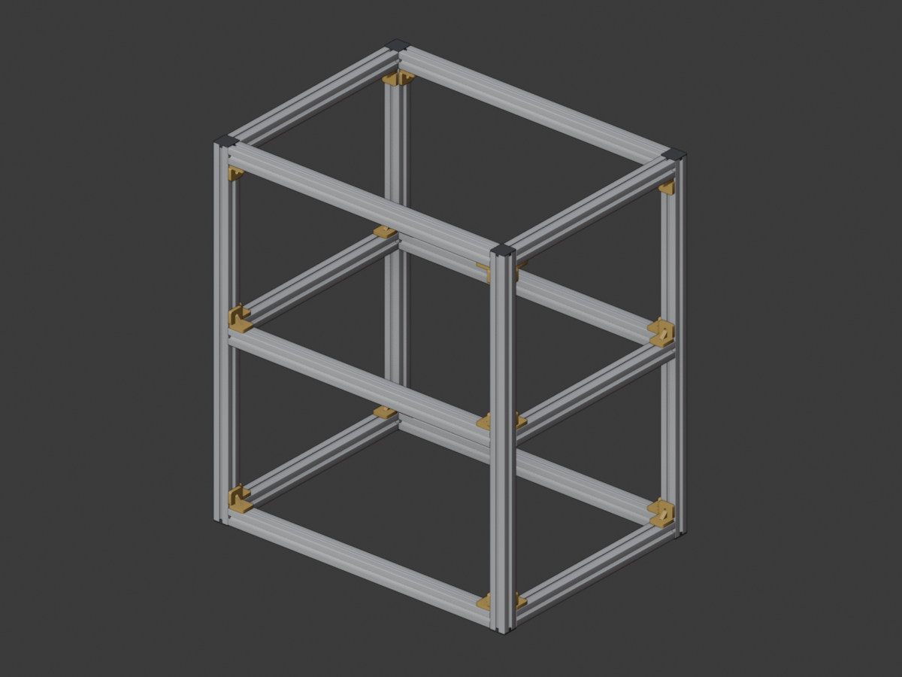
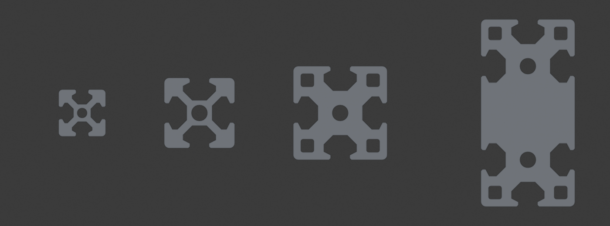
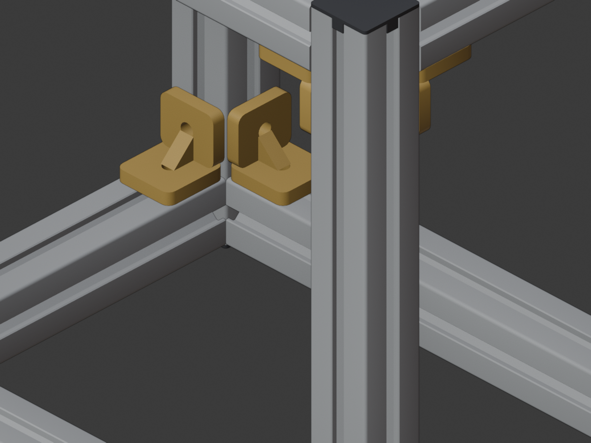
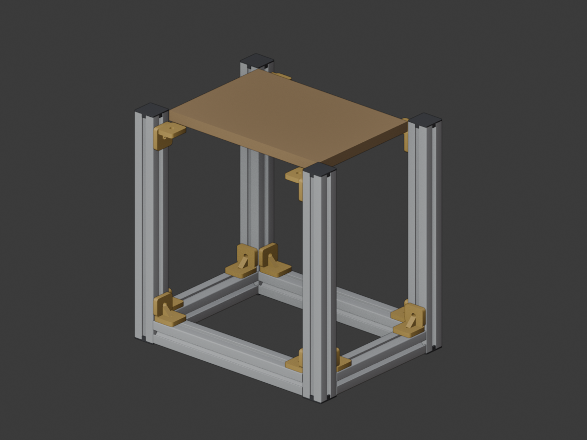

# AluGen

Parametric aluminium extrusion profiles for Blender. Model a real T-slot frame
at true size, snap the parts together exactly, and export a cut list and
hardware list you can order from any extrusion supplier.



AluGen generates the profile cross-section procedurally, so every profile in the
scene carries its real ordering data: edge sizes A and B, slot system, and cut
length in millimetres. Change the length and the mesh, the end caps and the
parts list update with it.

Tested with Blender 5.2 LTS, runs on Blender 4.2 and newer.

## Features

- **Profiles**: I-type extrusions with 5 mm and 8 mm slots, edge sizes 20, 30,
  40 and 80 mm in any combination. Multi-cell sizes such as 40x80 or 80x80 get
  the correct number of slots and core bores.
- **Exact joints**: butt a profile against an end face, stand it perpendicular
  on a face, lay it parallel against a face, or fit its length between two
  other profiles. Placement is computed, not eyeballed.
- **Hardware**: end caps, angle bracket sets, T-slot nuts, slot bar connectors,
  butt joint connectors and cube corner connectors, each placed flush against
  the profile it belongs to.
- **Brackets without a second profile**: mount an angle bracket anywhere on a
  single profile, free to slide along its length and to rotate around its axis,
  for panels, plates, feet, rails or anything else that is not another
  extrusion. It still lands in the parts list.
- **Frame generator**: enter outer width, depth and height, get four posts,
  the rails, the brackets and the caps with the correct cut lengths.
- **Parts list**: live in the sidebar, exportable as CSV and TXT, grouped by
  profile size and by hardware type.
- **Validation**: flags cut lengths outside the usable range, scaled objects
  whose dimensions no longer match, and unusual slot and size combinations.



*20x20 slot 5, 30x30 slot 8, 40x40 slot 8 with corner cavities, 40x80 slot 8.*

## Installation

1. Download `alugen-1.1.0.zip` from the releases page, or build it yourself
   with `./scripts/build_zip.sh`.
2. In Blender open `Preferences > Add-ons`, use the dropdown in the top right
   and choose `Install from Disk...`, then pick the zip.
3. Enable the entry named **AluGen**.

The panels appear in the 3D viewport sidebar (press `N`) under the tab
**AluGen**. There is also an entry in `Add > Mesh > AluGen Profile`.

To work from a checkout instead, copy or symlink the `alugen` folder into your
Blender extensions directory, for example
`~/Library/Application Support/Blender/5.2/extensions/user_default/` on macOS,
`%APPDATA%\Blender Foundation\Blender\5.2\extensions\user_default\` on Windows,
or `~/.config/blender/5.2/extensions/user_default/` on Linux. Then use
`Refresh Local` in the add-on preferences.

## Quick start

1. Press `Set up scene in mm`. Units switch to millimetres so every field reads
   the way you order.
2. Pick A, B, slot, length and the axis, then press `Add profile`.
3. Select two profiles. The one you click last is active and is the one that
   moves. Press `Butt against end`, `Perpendicular on face` or
   `Parallel to face`.
4. Press `Add bracket at joint` to place an angle bracket in the corner, or
   `Add bracket on profile` to put one anywhere on a single profile. Press
   `Add end caps` for the open ends.
5. Open the `Parts list` panel and press `Export parts list`.

Faster route for a whole structure: open the `Frame generator`, enter the outer
dimensions and press `Build frame`. The cut list is shown before you build:

| Part | Cut length |
| --- | --- |
| 4 posts | `Z` |
| 2 X rails per level | `X - 2 * A` |
| 2 Y rails per level | `Y - 2 * B` |

The outer dimensions come out exact. A 800 x 600 x 900 mm frame measures
800.000 x 600.000 x 900.000 mm in the scene, which the test suite checks on
every run.



## Brackets that carry something other than a profile

`Add bracket on profile` mounts a bracket on the active profile alone, so you
can model the hardware for a table top, a side panel, a foot plate or a sensor
mount and still get it counted.

- **Offset from start** slides the bracket along the profile.
- **Rotation** turns it around the profile axis. It snaps to the four faces by
  default; switch **Snap to faces** off for a free angle, in which case the
  bracket sits tangent to the rounded corner.
- **Lateral offset** shifts it across the face, for example onto the second
  slot of a 40x80.
- **Free leg** picks which way the mounted leg runs and therefore which side
  the mating part sits on.
- **Bracket size** defaults to the profile grid and can be overridden.

The bracket is parented to the profile, so it travels with it, and the profile
stays active so you can place several in a row and tune the last one in the
redo panel.



*Four brackets placed on the posts at 382 mm carry an 18 mm panel flush with
the post tops. The panel itself is not an AluGen part.*

## Panels

| Panel | What it does |
| --- | --- |
| Add profile | Scene setup, new profile, copies in a row |
| Edit selection | Change the dimensions of the selected profile, mesh rebuilds live |
| Join | Butt against end, perpendicular on face, parallel to face, fit length between |
| Hardware | End caps, angle brackets at a joint or anywhere on a single profile, T-slot nuts, connectors |
| Frame generator | Full cuboid frame with a cut list preview |
| Parts list | Live list, CSV and TXT export, clipboard, text block, validation |

## Accuracy

Exact, and safe to order from:

- outer dimensions A and B and the cut length, in millimetres
- slot positions, centred per grid cell on all four faces
- slot mouth width 5.2 mm for slot 5 and 8.2 mm for slot 8
- core bore diameter 4.2 mm for slot 5 and 6.8 mm for slot 8, one per cell
- grid interpretation: 20 is one cell, 40x80 is two cells, 80x80 is four cells

Realistic but representative, derived from the common I-type standard rather
than from one manufacturer's drawing:

- the inner shape of the slot chamber, its depth and the 45 degree run-out to
  the slot floor
- slot lip thickness, chamfers and corner radii
- optional corner cavities, which are cosmetic
- internal webs are not modelled, the profile is solid inside

Every one of those values lives in `alugen/catalog.py` under `SLOT_SYSTEMS`.
Measure your own profile, change the numbers, and the whole cross-section is
regenerated from them.

Hardware is placed functionally correctly: brackets sit flush in the joint and
screws sit on the slot centre line. The part shapes themselves are simplified
stand-ins for visual checking, not manufacturer models. What matters for
ordering is the description in the parts list.

## Limitations

- Brackets are centred on the profile face. On multi-cell profiles such as
  40x80 the face centre falls between two slots, so brackets there need to be
  moved by hand. The frame generator warns when A and B differ.
- Fasteners are not simulated, and there is no collision or load check.
- Do not scale objects. Change the `Length` field instead. The validation
  reports scaled objects because their dimensions no longer match the model.

## Development

Run the headless test suite:

```
blender --background --factory-startup --python tests/test_alugen.py
```

It checks that every cross-section is free of self-intersections, that the
generated meshes are watertight with outward normals, that outer dimensions and
cut lengths are exact, that brackets touch two profiles without intersecting
them, and that the operators and the parts list export behave.

Regenerate the documentation images and the example file:

```
blender --background --factory-startup --python scripts/make_docs_images.py
blender --background --factory-startup --python scripts/make_example.py
```

## Repository layout

```
alugen/          the add-on
  catalog.py     slot systems, sizes, generic hardware descriptions
  geometry.py    cross-section, extrusion, hardware meshes
  props.py       property groups on object and scene
  builder.py     object creation, materials, placement
  operators.py   operators
  assemblies.py  frame generator
  bom.py         parts list and validation
  ui.py          sidebar panels
docs/images/     rendered documentation images
examples/        example blend file
scripts/         build and rendering helpers
tests/           headless test suite
```

## License

GPL-3.0-or-later, matching Blender's Python API.
